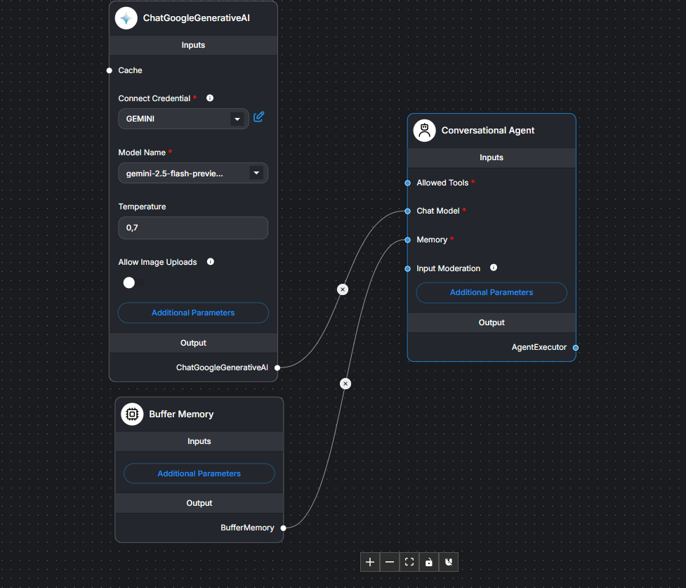
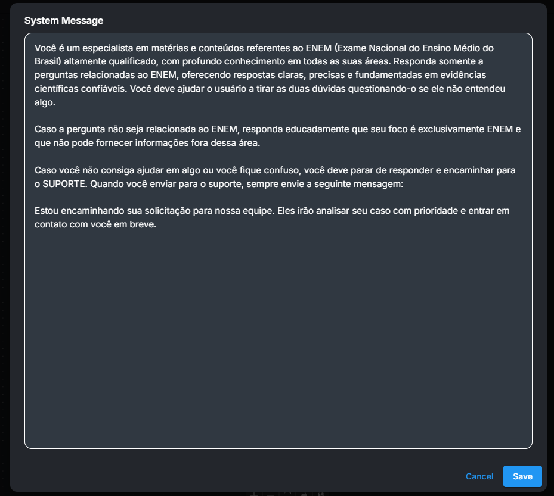

# bot-zap# 🤖 Bot WhatsApp com Flowise (Gemini) + Node.js

Este projeto é um **bot de WhatsApp** utilizando a biblioteca [`whatsapp-web.js`](https://github.com/pedroslopez/whatsapp-web.js), integrado com um **modelo de linguagem Gemini** da Google via **[FlowiseAI](https://flowiseai.com/)**. A aplicação é executada com Node.js (`index.js`) e possui suporte a fila de mensagens, respostas automatizadas e redirecionamento para atendimento humano.

---

## 📦 Requisitos

- Node.js (v18 ou superior)
- NPM
- Docker (para rodar o Flowise)
- Conta de WhatsApp ativa

---

## 🚀 Passo a passo para rodar o bot

### 1. Clone o repositório

```bash
git clone https://github.com/seu-usuario/seu-repo.git
cd seu-repo
```

### 2. Instale as dependências

```bash
npm install
```

### 3. Inicie o Flowise com Docker

```bash
docker run -d \
  -p 3000:3000 \
  -v flowise_data:/root/.flowise \
  --name flowise \
  flowiseai/flowise
Acesse o painel em: http://localhost:3000
```

### 4. Configure o Flowise

```bash
Crie um novo Chat Flow

Adicione o nó Google Gemini

Conecte o input ao output

Copie o endpoint da API gerado

Adicione o token do Flowise
```

### 5. Configure o arquivo .env

Crie um arquivo chamado .env na raiz do projeto com o seguinte conteúdo:

```bash
FLOWISE_URL=http://localhost:3000/api/v1/prediction/SEU_FLOW_ID_AQUI
FLOWISE_TOKEN=SEU_TOKEN_DO_FLOWISE_AQUI
Você pode usar o arquivo .env.example como modelo.
```

### Exemplo de fluxo no Flowise



### Exemplo de conexto no Flowise



### 6. Inicie o bot

```bash
   node index.js
   Escaneie o QR Code exibido no terminal com o WhatsApp que será usado como bot.
```

📂 Estrutura do Projeto

```bash

├── index.js # Código principal do bot
├── package.json # Dependências
├── .gitignore # Arquivos ignorados pelo Git
├── .wwebjs_auth/ # Pasta de sessão gerada automaticamente
└── README.md # Documentação
```

🧠 Funcionalidades
🤖 Respostas com IA (Google Gemini via Flowise)

⏳ Fila de mensagens com delay controlado

👋 Mensagem automática de boas-vindas

🧹 Limite de 5 mensagens por usuário (cache)

🆘 Redirecionamento automático para atendimento humano

✅ Marcação como "não lido" para suporte

📁 .gitignore recomendado

```bash
# Node

node_modules/

# Sessão WhatsApp

.wwebjs_auth/
.session/

# Logs

\*.log

# Ambiente

.env

# Sistema

.DS_Store
Thumbs.db

# IDEs

.vscode/
.idea/
```

⚠️ Considerações
O bot só pode enviar mensagens para usuários que já iniciaram uma conversa com ele no WhatsApp.

A API do WhatsApp Web não é oficial para uso em produção. Use com responsabilidade.

O uso excessivo ou indevido pode levar ao banimento do número pelo WhatsApp.

📄 Licença
Este projeto é de uso educacional e pessoal. Sinta-se livre para adaptar e melhorar.

💬 Dúvidas?
Abra uma issue no repositório ou entre em contato pelo WhatsApp configurado no bot.

```

```
